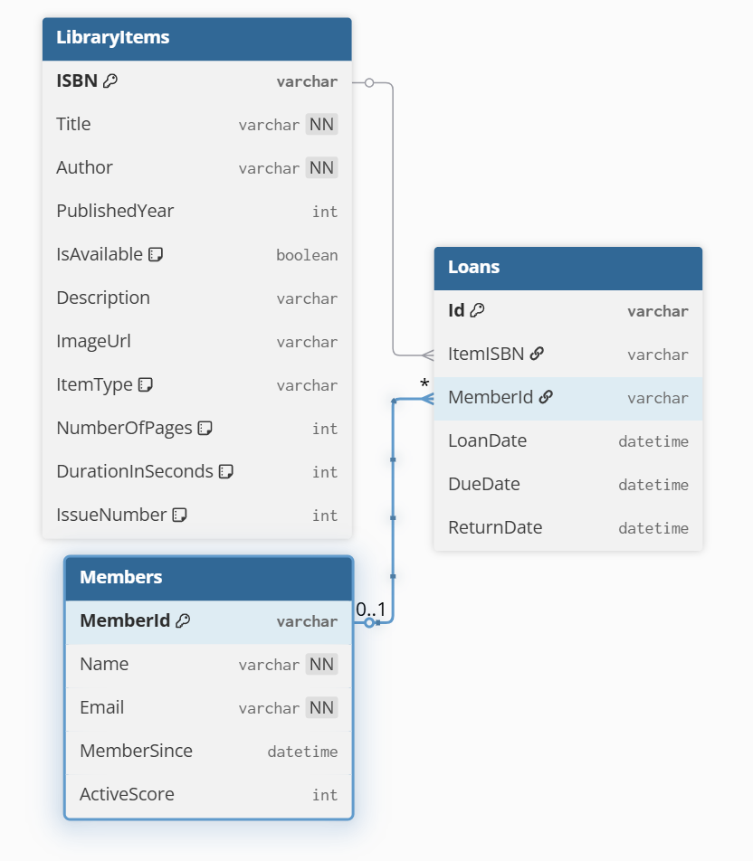
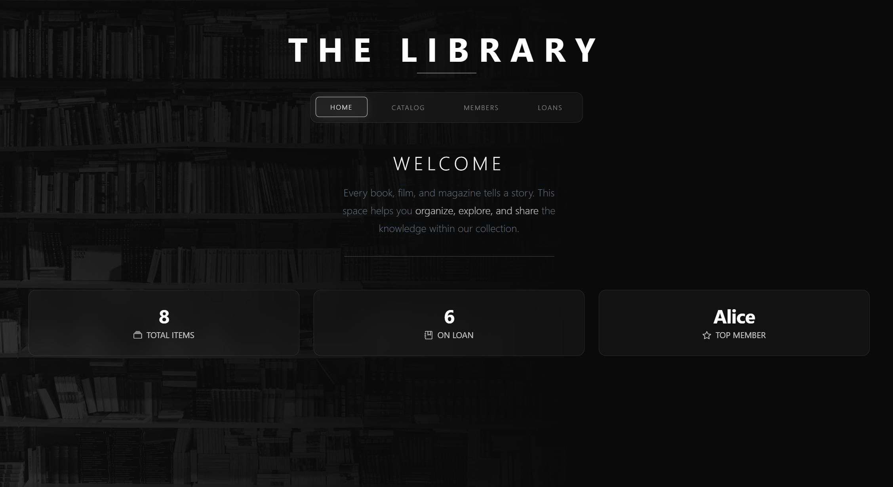
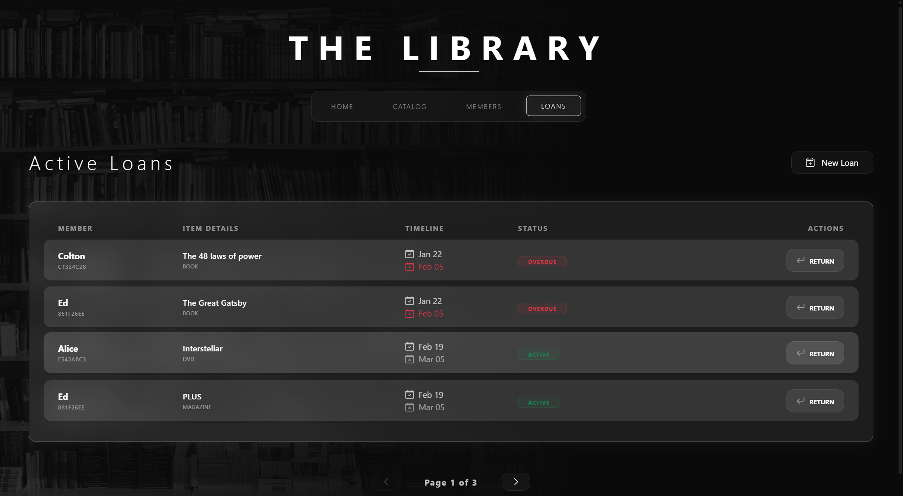
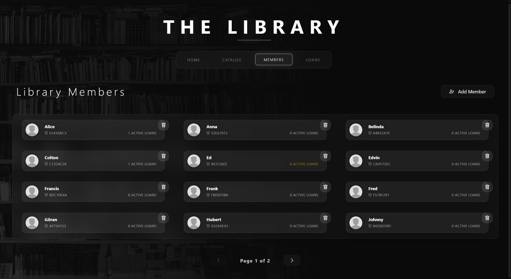
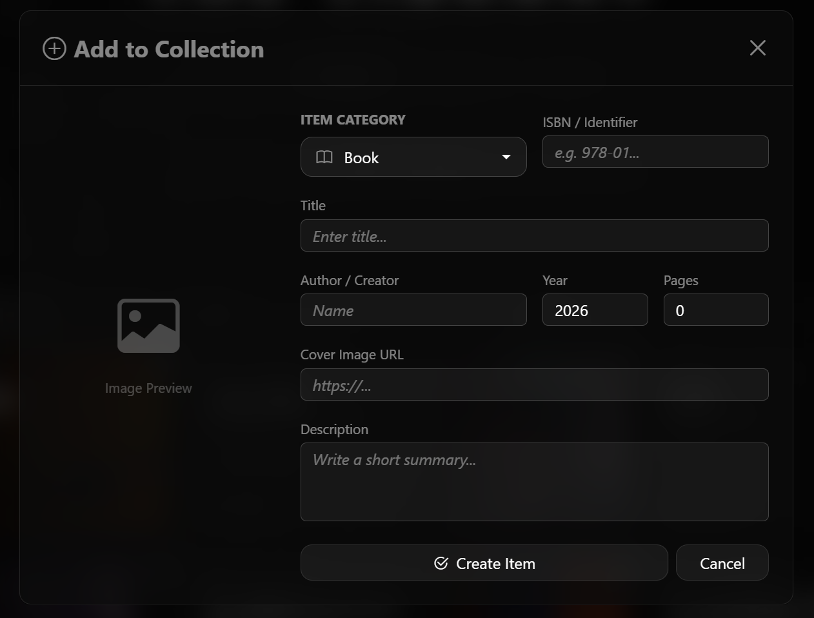
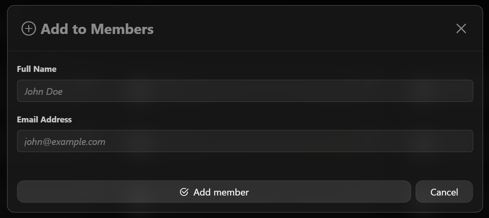

# Library Solution

A .NET 9 library management system built with C# using clean architecture principles. Manage books, DVDs, and magazines with a responsive Blazor UI, SQLite database, and features for searching, borrowing, and member tracking.

## Quick Start

### Prerequisites
- .NET 9 SDK
- SQLite (database file created automatically)

### Run the Application

Navigate to the Library.Web directory and start the development server:

```bash
cd Library.Web
dotnet watch
```

The application will open at `https://localhost:5023` with a responsive Blazor interface.

### Run Tests

```bash
dotnet test
```

## Features

- **Item Management**: Books, DVDs, and Magazines with availability tracking
- **Member Management**: Register and track library members
- **Borrowing System**: Borrow and return items with loan history
- **Search & Filtering**: Search library items by title, author, or ISBN
- **Responsive UI**: Works seamlessly on desktop and mobile devices

## Project Structure

- **Library.Core**: Business logic, models, and interfaces
- **Library.Data**: Data persistence layer with SQLite integration
- **Library.Web**: Responsive Blazor UI
- **Library.Tests**: Comprehensive unit tests

## Database Model

The system uses SQLite with the following main entities:



- **LibraryItem**: Base class for Books, DVDs, and Magazines with properties like Title, Author, ISBN, Availability
- **Member**: Represents library members with name and contact information
- **Loan**: Tracks borrowed items with borrow date, due date, and return date

The database is automatically created and seeded with sample data on first run.
(example library.db is included in the repo)

## Screenshots

### Home Page


### Catalog


### Loans


### Members


### Add Item


### New Loan


### Add Member

